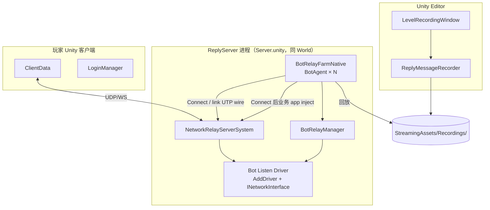
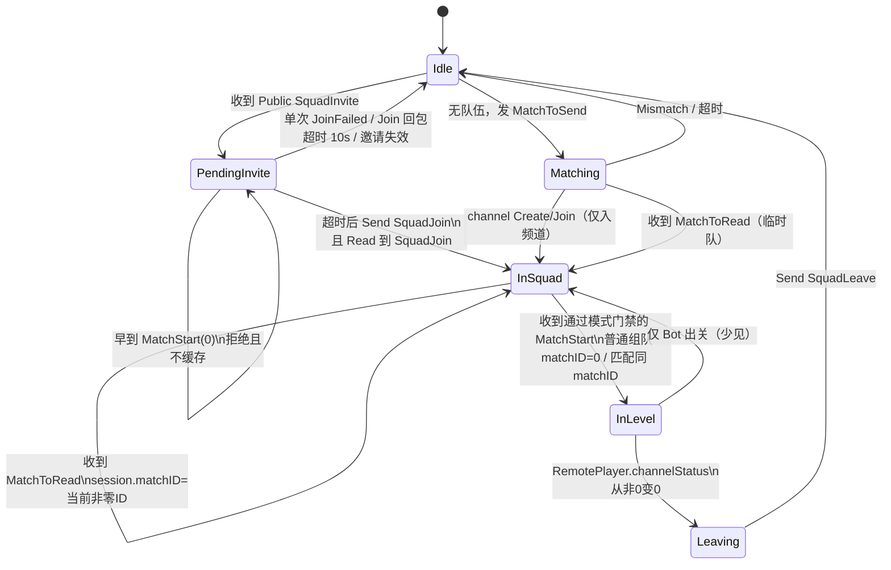

# 联机机器人 — 技术设计

> 基于 [联机机器人.md](./联机机器人.md) 需求，结合架构调研与产品澄清整理。  
> **原则**：机器人代码与文档归属 `ZGUPTerminator`，按程序集拆为 `Terminator.MultiplayerBot*` 同级目录；`BotConfig.asset` 保持工程级配置；Server 撮合零分叉。  
> **部署权威**：[联机机器人-架构约束.md](./联机机器人-架构约束.md) · [联机机器人-文档索引.md](./联机机器人-文档索引.md)

---

## 1. 已确认的设计决策

| 议题 | 决策 |
|------|------|
| **Bot 部署（生产）** | **与 ReplyServer 同进程共部署**（`Server.unity` + `BotCoDeployBootstrap`）；单进程 Farm 内 `minBots`～`maxBots` 个 agent |
| **独立 Headless** | **已于 2026-07-22 彻底下线**：删除 `BotEntry`/`BotService`/`BotClient`、专属回放代码、场景与创建菜单；Bot 仅可通过 `Server.unity` 的共部署 Farm 运行。 |
| Bot 账号 | userID 由产品保证在 ReplyServer **合法**；`userName/avatar/power` **按 userID 配表**（影响真人 UI） |
| ReplyServer | 与玩家客户端**相同**实例（共部署）；`BotConfig.replyServerAddress/Port` 仅供真实服务器测试客户端和录制工具连接本地服务。 |
| **传输边界** | 原始 UTP Connect 握手 / 必要 link ACK 用 Capture 的 UTP wire；Connect 后 Bot→Server 的全部业务消息经 Server 已开放 inject API 进入既有 `NetworkRelayServerHandler.Read`。Server→Bot 仍经 `RouteSend` + 结构化 PopEvents walk；其中应用层 `NetworkRelayMessageType.Connect(type=0)` 是当前远端成员重连状态，必须与 UTP 握手分开精确解析。不猜、不重建业务 UTP wire |
| **链路就绪** | 只认 `BotRelayTransportFlags.Connected`：Connect 注入只置 `ConnectRequested`，收到本次真实 server hello 才置 `Connected`；不保留 relay-ready / initial-status-ready 镜像 |
| **匹配绑定** | 只认 `session.matchID`：0 为未匹配，非零值只由当前 `ClientMessageMatchToRead` 首次写入；同 ID 重复只幂等，不同非零 ID 不得覆盖已提交代次；Server→Bot 的 `Mismatch` 通知仅可取消相同当前代次。不保留 `matchPaired` 镜像布尔值 |
| **Invite 格式** | 只接受当前完整 SendRelay Invite 与本次 WireCatalog Capture 的唯一 framing；完整 `FixedBytes80` 后必须恰好 EOF，不兼容连续/截断/offset/shell/junk/文本恢复 |
| 世界邀请 | 收到 Public `SquadInvite` → 延迟 `SquadJoin` → Read 到 `SquadJoin` 算入队成功 |
| 玩法范围 | **不区分**排位/关卡组队；统一逻辑：观察到真人进匹配池并超时后就近派 Bot，有世界邀请则优先入队 |
| 空闲条件 | 不在队伍 **且** 未进入关卡（`channelStatus == 0`） |
| 匹配（空闲） | **不主动**进池；Farm 只读 `NetworkRelayServer.AsReadOnly().matchIDs`，对非 Bot 成员等待 `matchTimeoutMin/Max` 后派段位最相近的 Idle Bot 发 **`ClientMessageMatchToSend`**（见 §3.4 路径 B，非 ApplyMatch） |
| 匹配（队内） | Bot **恒为队员**（不发世界邀请）；收到队长 `ApplyMatch` → 回发 `ApplyMatch` 同意 |
| 匹配（撮合成功） | 直接 Read 到 `ClientMessageMatch`；真人 UI 倒数后同时调用 `LoginManager.Register` + `LoginManager.ApplyStart`，随后进入 `LoginManager.__Start` |
| 进关角色 | **组队入队**：恒为 Client；**单人匹配**：Server 按撮合顺序 Assign Creator/Joiner，Bot **可能是 Host 或 Client** |
| 结算离队 | `RemotePlayer.channelStatus` 从非 0 → 0 → `SquadLeave` |
| 录制范围 | LocalPlayer：**Camera、Move、Damage、SelectSkill、PlayerProperty** |
| 录制起始 | **方案 A**；开始录制时若有 `GameSceneManager` 则 `LoadToDefault()` 进 Login 场景，走完整 `LoginManager.__Start` |
| 录制事实源 | 只认 opt-in completed-`EndWrite` journal 中的真实提交；payload/全局 sequence/producer `epoch + double timestamp` 原子绑定，并与 Apply/Clear、send/retry cursor 独立。禁止槽扫描、批次插值和 PlayerProperty 合成 |
| 录制索引 | **组队和匹配共用同一套目录优先级：`Recordings/{StageID}` → `Recordings/{LevelID}_{stage}` → `Recordings/{sceneName}`**。其中 `sceneName` 比较值为 `Path.GetFileName(matchStart.sceneName)`；Stage、level、stage、scene 全部来自通过当前代次门禁的 `ClientMessageMatchStart`。Play/ChapterStage 作为当前真人协议由 Bot 协议层完整消费，但 Bot 状态层不从中取得或补齐进关索引（见 §4.3） |
| 录制部署 | **`StreamingAssets/Recordings/`**；该目录被 `Assets/.gitignore` 忽略，必须从资源工程同步，不能假定源码工程自带 |
| 录制版本 | 只接受 **TRBT v2**；`Read` / `ReadHeader` 对 v1、未知版本或损坏文件 fail-close，不做迁移读取 |
| Bot 规模 | 启动时按 `minBots`/`maxBots`/`botProfiles` 固定 spawn agent 数；**运行时动态扩缩尚未实现**（规划见落地方案 Phase 5） |
| **禁止 Bot vs Bot** | 机器人仅配合**真人**表演；**不得** Bot 与 Bot 互相匹配占用服务器资源（见 §3.6） |
| 取消匹配 | 邀请入队前 Bot 须经 Server API 注入 `Mismatch` 清除 server `match`；Spawn 保持 `nextIdleMatchTime=+Infinity`（生产不主动 MatchToSend；见 §8 / 架构约束 M4） |
| 进关握手目标 | **不让真人客户端卡死**；不调用 IUserData |

---

## 2. 系统架构



### 2.1 共部署形态（生产）

- **入口场景**：`Assets/Scenes/Server.unity`（挂 `NetworkRelayServerManager` + `BotCoDeployBootstrap`）
- **配置**：`Assets/Resources/Bot/BotConfig.asset`（使用方工程资产，`enableCoDeploy = true`）
- **初始化**：`BotCoDeployBootstrap` → `BotRelayWorld.TryInitialize` → WireCatalog 仅采原始 UTP Connect 握手/server hello/link ACK 与当前入站定位 → `BotRelayFarmSpawner` spawn N agent
- **热路径**：`BotRelayAgentSystem` PreTick / PostTick + Job 链（见架构约束 §4）
- **不加载**关卡场景、角色 Prefab、UI；协议状态在 `BotSessionState` / `BotRelayFarmNative`，**不写** `ReplyMessageShared`

### 2.2 独立 Headless（已下线）
- 2026-07-22 已删除 BotEntry batch-mode 自动启动、BotService/BotClient、专属回放实现、BotBootstrap.unity 及其 Editor 创建菜单。
- ClientData 仍用于真实服务器测试与录制工具，不会自行驱动机器人状态机。
- Bot 的唯一运行路径为 Server.unity 中的 BotCoDeployBootstrap + Farm。

### 2.3 与 ReplyServer 的关系

Bot 与玩家客户端在 Server 视角 **对等**：均经 Relay Handler 收发 Channel / Public / Identity。共部署下 Bot 不经真实 socket：Connect / link 层由 `BotRelayManager` 注入确知 UTP wire，Connect 后业务 app 经 `BotRelayInjectQueue` / `NetworkRelayServerInjectSingleton` 进入同一 Handler；Server→Bot 仍由 `RouteSend` 投递后解析。Bot 不依赖游戏 HTTP 服（`IUserData`）。

原始 UTP Connect wire 不是全 Farm 通用模板：其 payload 含 `ClientHeader`。启动时以第一个 Bot 做完整 catalog Capture，其余 Bot 各自做 Connect-only Capture，最终将握手 wire 以 agent range 写入不可变 Blob；PreTick 只注入当前 agent 的 range。这样仍保持「仅握手 Connect 走 UTP」，同时保证 Server 为每个 Bot 建立独立 identity。

Connect 注入完成只表示 `ConnectRequested`，并会清除上一会话的 `Connected` / live hello。只有收到本次连接真实 server hello 后才能设置 `Connected`；初始 Status(0)、注册与 reactive 匹配派遣全部直接检查这个唯一门禁。一次性 `relayServerStatusInjected` 只说明业务 Status 已注入，不等于链路就绪。

---

## 3. Bot 状态机



### 3.1 优先级规则

1. **组队邀请 > 匹配**：`Matching` 收到新的外部 `SquadInvite`（世界 `Public` 或按 bot userID 投递的 `Private`）时取消/挂起匹配，优先处理邀请；`Squad` channel relay 属队内流量，不触发加队。`PendingInvite` 已承诺当前邀请，忽略其后的 Invite，直到收到**一次** `JoinFailed`、`Leave`，或 Join 发出后 10 秒仍无 `Join/JoinFailed` 而主动释放回 `Idle`
2. **单 Bot 单队伍**：同一 Bot 实例同一时刻只服务一个 Channel
3. **禁止 Bot vs Bot / 抢同一队**：Farm 内至多一条尚未收到 `MatchToRead` 的 outstanding `MatchToSend`；当前 Bot 一收到 MatchToRead 就立即释放匹配槽，不等待临时 squad Join，其他空闲 Bot 可开始下一次匹配。队伍租约按 `squadID` 去重，同一 squad 任一时刻仅一台 Bot 接受，不同真人 squad 可由不同空闲 Bot 并发服务；若 `remoteUserID` 为 Bot 账号则 `Mismatch` + `SquadLeave`（见 §3.6）

### 3.2 各状态行为

| 状态 | 行为 |
|------|------|
| **Idle** | 处理 Inbox 事件；Connected 后注入一次 Status(0)；若队伍槽空闲可接受新的外部 Invite（Public/Private）；忽略队内 `Squad` relay；**不**因空闲主动 `MatchToSend`（由 `TickMatchDispatch` 观察 `matchIDs` 后派遣） |
| **PendingInvite** | 原子持有 Farm 队伍槽、记录 `squadInviteID` 与 Host/邀请代际；`Random.Range(inviteTimeoutMin, inviteTimeoutMax)` 后只发送一次 `ClientMessageSquadJoinToSend`。`Join` 尚未确认 current squad 前收到的任何普通 `MatchStart(matchID=0)` 都直接拒绝且不缓存。发出 Join 后等待 `Join/JoinFailed` 最多 10 秒；失败或静默超时按 `Leave → Mismatch → Status(0)` 清理并释放租约回 Idle |
| **Matching** | 等待 `Match` / `Mismatch`；channel Create/Join 可先转 InSquad，但只表示频道成员关系，`session.matchID` 仍为 0 |
| **InSquad** | 若尚未匹配成功且收到队长 `ApplyMatch`，只回同类型消息表示同意；收到 `MatchToRead` 后不再响应迟到的 `ApplyMatch`。预组队匹配在 `MatchToRead` 前必须保持本地 `channelStatus=0`。普通组队只接受 Join 确认 current squad/Host 后新到的 `MatchStart(matchID=0)`；匹配只接受 `MatchToRead` 已建立当前代次后新到且 matchID 相同的 MatchStart。Play/ChapterStage 仍按当前真人协议完整消费，但与 Status 一样不能作为 Bot 进关 Stage/tuple |
| **InLevel** | 按 §4.3 的统一优先级（`StageID` → `LevelID_stage` → `sceneName`）随机选录制；`BotReplayLogic` 按时间戳写入 `BotRelayInjectQueue`，经 Server Handler 消费。回放时间必须按完整 Server `DeltaTime` 推进，不得把每 Tick 时间硬截为 0.1s，也不得按固定条数拆分已经到时的帧；同一录像时间戳的一批消息必须在同一 Server Tick 注入，低 Tick 时则一次注入该时间点前全部已到期帧。时间戳塌缩等异常由 `Tools/MultiplayerBot/Recording Batch Audit` 在素材审计阶段报错，运行时不以限流掩盖异常录像。录像播完只表示后续没有录制动作，**不代表真人已出关，也不得因此离队或重新接受邀请**。Server 明确下发 `Drop`（房主移除本 Bot）时例外：立即清理关卡状态并回到 Idle。 |
| **Leaving** | `ClientMessageSquadLeave` + Status(0) → 回到 Idle 并释放队伍槽 |

**实现**：`BotAgentLogic` 是唯一机器人状态机；不再保留独立客户端状态机。

### 3.3 加入成功判定

对齐 `ClientData.ReadMessageType`：

- 收到 `ClientMessageType.SquadJoin`（`ClientMessageSquadJoinToRead`）→ 正式入队
- 仅发送 `SquadJoin` 不算成功，需等待 Read 侧确认
- 单个 `JoinFailed` 即为本次邀请的确定失败，不等待第二次；若 Server 对 Join 静默无回包，10 秒本地响应期限同样终止本次邀请并释放占位
- 超时后到达的 `SquadJoin` 不得把 Idle Bot 或正在处理另一邀请的 Bot 拉回旧队伍；Bot 只按当下 `BotState` 与当前 squadID 门禁拒绝并投递有序清理，不保存旧 squadID/迟到消息缓存
- 处理 Read 侧 `SquadJoin` 时，状态迁移必须同时提交 `session.channel=squadInviteID`；不能只依赖 Inbox 在事件入队前写频道。否则直接注入或一帧同步延迟会出现 `InSquad + CHANNEL_NULL`，下一帧掉回 Idle 并放大重复 Join/进关握手
- `SquadJoin` 的本地提交链不得被回放清理打断。`BotReplayLogic.Stop/Tick` 是 Job 调用链内部 helper：位于 Burst Job 下时由外层 Job 传递编译，位于 managed Job/测试下时直接作普通静态调用，方法本身不得再标独立 `[BurstCompile]`。否则 Linux/Mono 的 managed Job fallback 会尝试调用 `Stop$BurstDirectCall → Stop$BurstManaged`，因缺少 `MonoPInvokeCallback` 抛出 `NotSupportedException`，留下 `channel` 已更新、但状态仍是 `PendingInvite` 的半提交状态；watchdog/后续邀请会表现为反复离队再加入。当前是否持有邀请只由 `BotState.PendingInvite` 表达，不再保留第二个布尔镜像

### 3.4 匹配流程（两条路径）

#### 路径 A — 已在队内（Bot 恒为队员）

```
[真人队长] ApplyMatch
[Bot 队员] Read ApplyMatch → Send ApplyMatch（同意）
[真人队长] ClientMessageMatchToSend → 进入匹配池
[撮合成功] 双方 Read ClientMessageMatch（MatchToRead）
[真人 UI]  GetMessage_Match → LoginManager.Register → 倒数 → LoginManager.ApplyStart
[Bot]      session.matchID=当前非零ID → 等待同 ID 的 MatchStart
           非 Host：先发登录 PlayerProperty(Status=0)，下一 Tick 再进关
```

#### 路径 B — 空闲单人匹配（reactive）

```
[真人]     ClientMessageMatchToSend → 进入 Server matchIDs（Matching）
[Farm]     PostTick 只读 NetworkRelayServer.AsReadOnly()（无 Complete）
           过滤非 Bot（BotMatchGuard.IsFarmBotUser）→ 记录 observe + matchTimeout 随机延迟
[超时后]   若该 user 仍在 matchIDs：选 Idle Bot 最小化 |matchLevel - distance|（并列：`userID ^ matchObserveGeneration` 确定性抽样；每次重进池 generation+1，可换人）
           → ClientMessageMatchToSend { level = 该 Bot 的 matchLevel }
[撮合成功] Server 建立临时队伍，双方 Read ClientMessageMatch；不经过 ApplyMatch 征询
[真人 UI]  GetMessage_Match → LoginManager.Register → 倒数 → LoginManager.ApplyStart
[Bot]      session.matchID=当前非零ID → 直接进入匹配进关路径；isHost 仅影响频道角色（§10.4）
```

`nextIdleMatchTime` 生产侧保持 `+Infinity`；仅测试/harness 可写有限值强制单次 MatchToSend。

**术语校正**（对齐 `Mini_RankedMatchManager`）：

| 消息 | 含义 |
|------|------|
| `ClientMessageMatchToSend` | **申请进入匹配池**（单人点「挑战」、队长发起匹配） |
| `ClientMessageApplyMatch` | **队内同意匹配**（队员响应队长） |
| `ClientMessageMatchToRead` | **撮合成功**（Server 下发，非客户端发送） |

Bot 空闲时发 **`MatchToSend`**，不是 `ApplyMatch`。

**两条匹配路径的边界**：预组队路径在 `Match` 前多一段“队长发 `ApplyMatch` → Bot 回 `ApplyMatch` 同意 → 队长发 `ClientMessageMatchToSend`”；单人撮合建立临时队伍时没有 `ApplyMatch` 征询，直接等待撮合结果。两者的共同权威事件都是 Server 下发的 `ClientMessageMatchToRead`：只有它可以把当前非零 ID 写入 `session.matchID`，随后统一进入 `LoginManager.Register` + `LoginManager.ApplyStart` 对应的匹配进关阶段。`session.matchID` 是唯一匹配绑定事实源；`Create` / `Join` / `ChapterStage` 只提供频道或候选关卡信息，不能替代 `MatchToRead`，也不得在预组队匹配阶段注入非零 Status；收到 `MatchToRead` 后迟到的 `ApplyMatch` 必须忽略。

`MatchToRead` 同时是匹配的 **Stage 代际边界**：预组队频道可能仍携带 lobby/上一关的非零 `remoteChannelStatus`。收到 Match 时必须清空 `targetUserStageID`、`lastSeenChapterStage`、`remoteChannelStatus` 和旧 `PlayerProperty` 就绪标记。随后只接受与当前非零 `matchID` 一致的 `ClientMessageMatchStart`。该消息由真人 `LoginManager.__Start` 在本次启动进入 `Waiting` 边界、取得权威 `userStageID` 后发出，并携带同一次启动的 `isRestart/levelID/stage/levelName/sceneName`。重复 `Join/Create` 内嵌的旧 channelFlag、录像 Header 与本地 `UserDataMain` ID 都不能替代该描述。

**MatchStart 下行解码约束**：`LoginManager.__Start` 每次关卡启动只在 `Waiting` 边界发送一次；该 Server→Client Channel 本身是可靠通道，Bot 不做应用层循环重发。Server wire 只按 WireCatalog 本次 Capture 的唯一 framing 分出完整 app；`type=24` 必须完整校验 SendRelay header 和 `ClientMessageMatchStart` body 后原样交给 Inbox，且 `matchID=0` 是合法普通组队值，不能被 L2 拒绝。禁止 inner-offset 扫描，level/scene 字符串中的任意字节可能被误判成另一个合法控制类型。L2 保留完整消息不等于状态层接受：普通组队的 Join/current squad/current Host、或匹配的 MatchToRead/current matchID 代际尚未成立时，MatchStart 一律拒绝且不缓存；不得为乱序补建 pending。

**`__Start` 发送前置条件**：统一发送点固定在 `Waiting` 状态边界；此时必须已经取得本次权威 `userStageID`，且 `IClientData.instance` 已就绪。任一条件缺失时必须报错并 fail-close，不能继续进入会让远端永久等待的关卡握手。匹配的 ID 来自当前 `LevelShared.match`（非零），普通组队显式写 0；发送后不得在后续等待循环重复广播，也不得在 `ApplyStart` 或其他调用方重复判断/发送。

**统一 MatchStart 的模式门禁**：`matchID=0` 表示普通组队，仅当 `Join` 已确认 current squad，且 sender 是该 squad 当前 Host 时当场消费；`matchID>0` 表示匹配，仅当 `MatchToRead` 已建立当前匹配代次、消息 matchID 与当前非零 matchID 一致且频道关系有效时当场消费。门禁成立前的早到消息、旧代次消息、跨队消息和 ID 不符消息全部拒绝且不缓存。非零 `session.matchID` 首次提交后不可被另一非零 ID 覆盖；同 ID 重复只允许幂等，Server→Bot 的 Mismatch 通知只有携带相同当前 matchID 才能取消。消息内 `userStageID + level/scene tuple` 是 Bot 唯一进关权威；`ClientMessagePlay` 与 `ChapterStage` 保留现有真人协议语义，Bot 协议层完整校验并消费，但状态层不从 Play、ChapterStage 或 remote Status 生成进关事件，也不形成任何旧 Bot 兼容分支。

**Invite 严格解码**：当前唯一 app 布局为 `PackedInt Invite(104) + PackedInt relayType + PackedUInt senderID`，Flush 到字节边界后依次为 `PackedUInt levelID + PackedInt stage + PackedInt channel + FixedString512 text + FixedBytes80 header`，Header 后必须恰好 EOF。sender 只要求非零，stage/channel 非负；完整 app 自带的 sender 与 channel 是本邀请唯一权威，`channel=0` 合法且不改写。空闲期 Create/Join 不保存为后续 Invite 关联缓存；接受 Invite 后只在 `PendingInvite` 内保存该邀请 Host，Join 成功时一次性提交。WireCatalog 通过 live Null-pipeline 当前 Invite Capture 只测量指向首个 app 的 `inboundAppPayloadOffset`，不保存 Invite body；Runtime 唯一从 `offset - sizeof(ushort)` 开始完整 framing walk。不存在 continuous/truncated、0/8 双分支、候选 offset、shell/junk/anchor、文本/ASCII、历史长度或 Catalog mapping 恢复。

**为何仍保留主动 Query**：Query 只用于补齐 remote `channelFlag`、在线状态和诊断，不再作为匹配本地 Stage/场景来源。匹配进关必须等待 `MatchStart`；`Query` 回包仍须作为普通 PopEvents `type=13` 完整解码，不能按长度或 UTP 偶然前缀猜消息。

### 3.5 进关角色与握手（组队 Client / 匹配 Host 或 Client）

| 场景 | Bot 角色 | Server 判定 | Bot 行为 |
|------|----------|-------------|----------|
| **普通组队开关卡**（未进入匹配，`match==0`） | **恒为 Client** | 真人队长 `Create(Creator)`；Bot `Join`（无 Creator 位） | `Join` 确认 current squad/Host 后，等待并直接消费新到的 `MatchStart(matchID=0)`；早到拒绝且不缓存；不收、不发 `Play` 作为 Bot 进关协议 |
| **预组队后参加匹配** | **频道中仍为 Client** | `ApplyMatch` 同意后等待共同的 `MatchToRead` | `MatchToRead` 前保持本地 Status=0；收到匹配成功后等待真人 `LoginManager.__Start` 发出同 matchID 的 `MatchStart`，再分两 Tick 发 PlayerProperty 与非零 Stage |
| **空闲单人撮合形成临时队伍** | **可能是 Host 或 Client** | 无 `ApplyMatch`；撮合后建立临时频道并下发 `MatchToRead` | 与预组队路径相同：`MatchToRead → MatchStart → 两 Tick 登录/进关`；`session.isHost` 仅由频道 Creator 位决定 |

**Server→Bot 通道消息**（应用层 `Connect` / `MatchStart` / `Play` / `ChapterStage` / `ApplyMatch` / `PlayerProperty` 等）：ReplyServer 频道 relay 须经 `BotRelayNetworkInterface.RouteSend` → PostTick `TryDequeueToBot` → `BotRelaySlotInbox`（架构约束 M2）。共部署下与真人走同一 `NetworkRelayServerSystem` 发送路径；**禁止**在 Job 热路径 `Complete()` 整条 server 链。原始 UTP Connect 握手不属于这组 app；type=0 的应用层 Connect 是远端成员重连状态，按 `[Connect, channelFlag, userID] + EOF` 精确解析。L2 须正确分帧并完整消费每个当前协议结构；Bot 进关状态机只消费通过代次门禁的 MatchStart，Play/ChapterStage 完整消费后不生成进关事件，remote Status 也不得提供或补齐 Stage/tuple。

#### 3.5.1 Client 路径（普通组队 + 匹配作 Joiner）

| 场景 | 真人侧 | Bot 侧 |
|------|--------|--------|
| **组队** (`match==0`) | `LoginManager.__Start` 发 `MatchStart(matchID=0)`；既有 `Play` 继续只给真人 Client 调用 `Apply()` | `Join` 确认 current squad/Host 后只接受新到的 MatchStart；早到拒绝且不缓存，Play/ChapterStage/Status 均不参与 Bot 进关 |
| **匹配** (`match!=0`，预组队或临时队伍均适用) | 双方收到 `MatchToRead` 后先 `Register`，再由 UI **主动 `ApplyStart`** 进入 `__Start`；`__Start` 在 `Waiting` 边界广播同 matchID 的 `MatchStart` | `MatchToRead` 写入非零 `session.matchID`；代际成立后只接受当前 ID 的 MatchStart，从中取得服务器 Stage 与完整 entry tuple；Host/非 Host 统一先发 PlayerProperty(Status=0)，下一 Tick 发 PlayerProperty + 非零 Status 并启动回放 |

Bot 真正进关时统一发送 **PlayerProperty** + `Status(stageID)` inject。匹配在此之前多一个登录 Tick：收到通过门禁的 MatchStart 后先只发一次 PlayerProperty，`Status` 保持 0；PlayerProperty 成功后下一 Tick 才发送进关 PlayerProperty + 非零 Status 并启动回放。普通组队与匹配的 Stage、level/scene tuple 均只来自 MatchStart；收到的 Play、ChapterStage、remote Status、录像 Header 或本地客户端 ID 均不能参与选择或补值。录像未精确命中、找不到首个 PlayerProperty，或该 PlayerProperty 注入失败时必须 fail-closed：保持 Status=0、不启动回放。进关后**禁止追加 `Status(0)`**：真人 `ReplyMessages` 会把 Joined 后的非零→0 解释为 `Canceled`。清零只属于真正的 Leaving / Mismatch。

#### 3.5.2 Match Host 路径（单人撮合临时队伍且 `session.isHost`）

**关键**：匹配时真人**不靠**收到 `Play` 来启动进关，真人 Host/Client 均由 UI 主动走 `ApplyStart` 并进入 `__Start`。`LoginManager.__Start` 在两种模式都于 `Waiting` 边界单次广播 MatchStart；仅普通组队另外维持现有 `Play` 广播给真人 Client。Host 登录循环在远端 Status 已等于本关时仍继续等待/接受 PlayerProperty 触发 Joined，避免 Status/PlayerProperty 到达顺序造成卡死。

Bot 为匹配 Host 时：

1. `InSquad` 且 `session.matchID != 0`：等待 `remotePlayerCount >= 1`
2. 接收当前 matchID 的 `MatchStart`，不从 remote Status 推断本地关卡
3. 先注入回放首个 `PlayerProperty` 且保持 Status=0；下一 Tick 注入 `PlayerProperty + Status(userStageID)` 并启动回放
4. **禁止**向频道广播 `ClientMessagePlay`
5. Remote 出关 → `SquadLeave`（§3.7）

### 3.6 Bot vs Bot 规避（Bot 侧，Server 零分叉）

**目的**：Bot 为真人补位，不应 Bot↔Bot 互相撮合浪费 ReplyServer 匹配池与 Channel。

| 层级 | 机制 | 说明 |
|------|------|------|
| **入池期间** | Farm **outstanding MatchToSend 互斥** | `BotRelayFarmNative.matchingSlotOwner`（`NativeArray<int>` 长度 1，`[0]` 为 agent 索引或 `BotMatchGuard.NoMatchingSlotOwner`）：同一 Farm 内仅 1 个 agent 可保有尚未收到结果的 `MatchToSend`。收到 `MatchToRead` 时立即释放，不等待临时 squad 的 Create/Join；此时该 Bot 已不在 Server 匹配池，下一台空闲 Bot 可安全发起匹配 |
| **接受邀请时** | Farm **按 squadID 去重** | `BotRelayFarmNative.squadSlotLock`（长度 1）保护 `squadSlotSquadKeys`（每 Agent 一项，值为 `squadInviteID + 1`）。同一 Public/Private squad 广播仅第一台成功 claim 的 Bot 进入 `PendingInvite`，其余保持 Idle/Matching；不同 squad key 可由不同 Bot 同时持有。`Squad` channel relay 不参与 claim。每项到对应 Bot 的单次 `JoinFailed`、显式 Server `Drop` / `Leave`，或 Join 静默 10 秒超时回到 `Idle` 时独立释放；later Invite（可同 channel）重新可接受。 |
| **入队后** | **配对拒绝** | `session.remoteUserID` 若在 `BotConfig.botProfiles` → `Mismatch` / `SquadLeave` |
| **实现** | `BotMatchGuard` | `TryClaimMatchingSlot` / `TryClaimSquadSlot` / `ReleaseSquadSlot` / `IsFarmBotUser` |

全部 Bot 都在同一共部署 Farm，互斥覆盖所有生产 Bot；不存在独立进程或旧协议分支。配对拒绝仍作为竞态兜底，但不扩展任何旧消息格式。

**验收**：`Server.unity` 共部署 `maxBots≥2` 时，应仅 1 条尚未得到 MatchToRead 的活跃 `MatchToSend`；第一台收到 MatchToRead 后，槽必须在临时 squad Join 之前即可释放，使第二台可开始下一次匹配。同一广播 SquadInvite 只允许一个 Bot 进入 `PendingInvite`/`InSquad`，但两个不同 squad 的并发 Invite 应由两台空闲 Bot 分别接受；其中一台 `JoinFail` 后只释放自己的 key，不得影响另一 squad。无 Bot↔Bot `Match success`；误配对应有 `Bot-vs-Bot rejected`。

### 3.7 离队触发

共部署路径在 `BotAgentLogic.__TickChannelTracker` 维护 `session.remoteChannelStatus`：

```csharp
// 伪代码
if (prevRemoteChannelStatus != 0 && remoteChannelStatus == 0)
    TransitionTo(Leaving);
```

表示 **真人队友已出关**，Bot 发送 `SquadLeave` 并释放 Channel。录像回放耗尽不是会话结束信号：即使录像已经播完，Bot 仍保持 `InLevel` 和队伍占用，直到实时 `remoteChannelStatus` 从非 0 变为 0（并通过既有去抖）才离队；因此这段时间收到的新邀请必须忽略。

真人掉线统一由 Bot 的离线宽限处理，不再按队伍是否 `Temp` 分叉：Server `Disconnect` 只清 Online 位并保留频道/Stage Status；Bot 记录 `remoteOfflineSince`，默认等待 `BotConfig.remoteOfflineLeaveTimeout=5s`。宽限内同 ID 重连时，Server 下发当前应用层 `NetworkRelayMessageType.Connect(type=0)`；Bot 按 `[Connect, channelFlag, userID] + EOF` 精确解析并恢复该远端的 online/channel 快照，继续原队伍/关卡。该 app Connect 不设置 Bot 自身链路 `Connected`，也不能与原始 UTP Connect 握手混用。超时则 Bot inject `SquadLeave + Status(0)`，使大厅普通队、匹配成功但真正进关前的临时队、关内队都不会永久占用机器人。在通用 Server `Disconnect` 中对 `Temp + Status=0` 立即 `Leave` 会绕过宽限，并可能让真人客户端的 Match/UI/ApplyStart 异步流程只收到 `Leave` 而缺少一致取消终态，因此禁止。

`NetworkRelayMessageType.Leave` 与 `Drop` 不得合并处理：关内 `Leave` 可能来自 Host 启动协程的 Create/Join/Leave 重播，继续走实时 Stage 的去抖退出；`Drop` 是房主明确移除 Bot 的终态通知，必须在事件队列内同步停止回放、清空频道/Stage 并释放该 Agent 的 `squadSlotSquadKeys`。若同一批下行随后已有新的 Invite，应以清理后的 Idle 状态正常接受，不能把一次性 Invite 丢成 busy。

---

## 4. 关卡录制

### 4.1 录制消息类型

| ReplyMessageType | 写入来源（ZGUPTerminator 现行实现） | 频率 |
|------------------|---------------------------|------|
| **PlayerProperty** | `LoginManager.__SubmitStage` → `ClientData.BeginSend/EndSend` → `__Send` default 分支 | **进关一次**（存档属性，Host 靠此置 `RemotePlayer.Joined`） |
| Move | `ReplyMessageSystem` → `WritePositions` | 每帧（联机条件成立时） |
| Camera | `ReplyMessageSystem` → `WriteCameraRotations` | 每帧 |
| Damage | `ReplyMessageSystem` → `WriteEffectTargets` | 按需 |
| SelectSkill | `LevelSystem_SkillSelect` → `sendBuffer.BeginWrite` | 选技能时 |

五条路径**最终都进入同一个** `NetworkClientDriver.sendBuffer`（`BeginWrite` → 写 payload → `EndWrite`）。  
**不需要**分别从五个系统抽离 Write 逻辑。

录制文件中的 Reply payload 只接受当前布局：`[ReplyMessageType][NetworkRelayType]` 写完后 `Flush` 到字节边界，再接消息 body；录制 payload 本身不含 senderID。只有把录制帧重建为 Server 入站业务消息时，适配层才按当前 wire 布局补入 senderID。旧 sender-prefixed 录制布局不兼容、由 `RecordingAudit` 报错。

### 4.2 统一录制法（推荐，唯一实现）

**含义**：录制开始时在 `NetworkClientSendBuffer` 上显式开启一个 completed-`EndWrite` journal。它默认关闭，仅 Editor 录制会话启用；每个非空 `EndWrite` 在 producer 侧把 payload、副本顺序号和当时的 producer 时间戳一起提交：

```
1. BeginEndWriteCapture(initial epoch=0, timestamp=0)
2. 每个 producer window 前：
       Complete producer jobs
       SetEndWriteCaptureStamp(++epoch, Time.unscaledTimeAsDouble - session.startTime)
3. ClientData / ReplyMessageSystem 正常 BeginWrite → EndWrite
       EndWrite journal 原子记录 sequence + epoch + double timestamp + payload
4. 在 ECS 捕获点：
       TryPeekCapturedEndWrite → 拷贝 payload → ConsumeCapturedEndWrite
5. EndRecording 完成 producer jobs、做 final drain，再 clean EndWriteCapture
```

- journal 与 transport 的 send/retry cursor 是两套所有权：`Apply`、`Clear`、发送成功/失败都不会消费或重排录制条目；录制也不推进 transport 游标。
- 不再使用 per-slot read index 或 `TryReadPendingSendInWriteOrder`。同一 slot 连续多次 `EndWrite` 和跨 slot 写入都按全局 sequence 保序。
- Session 起点和 producer stamp 使用 `Time.unscaledTimeAsDouble` / `double`；写 TRBT v2 时才校验范围并转换为 `float`。每条消息保留它提交时的 producer timestamp，**禁止**对积压批次插值、均摊、补写或“把未来帧摊到当前采样点”。
- SelectSkill、PlayerProperty 无需单独 hook；只要由现行发送路径完成非空 `EndWrite`，就会进入同一 journal。
- **PlayerProperty** 通常出现在录制**开头**（`ApplyStage` 成功后发一次），与时间轴第一条 Move 并列；Bot 回放时按时间戳原样重发即可。
- 缺失 PlayerProperty 只允许诊断和阻止保存；禁止从 SharedStatic、本地属性或协议 fixture 合成/补写进录制 Session。
- journal 启动/推进/读取/结束失败，或发现 sequence、epoch、timestamp 倒退时记录 `captureError` 并 fail-closed；本次 Session 不得保存。

**录制文件帧结构**（不变，payload 已含 ReplyHeader，可解析 type）：

```
timestamp + length + payload
  payload 首段为 ReplyHeader → ReplyMessageType（Move/Camera/…/PlayerProperty）
```

**Bot 进关最低要求**（从录制中自动获得）：

1. 接收真人 `LoginManager.__Start` 发出的 `MatchStart`：普通组队要求 `Join` 已确认 current squad/Host 后收到 `matchID=0`；匹配要求 `MatchToRead` 已建立当前代际后收到相同非零 matchID。任何早到消息都拒绝且不缓存
2. 直接采用 MatchStart 中的服务器 `userStageID` 与完整 level/scene tuple；Bot 不从 Play、ChapterStage、remote Status、录像 Header 或本地客户端 ID 取得或补齐这些字段
3. 按统一的 StageID → LevelID_stage → `Path.GetFileName(matchStart.sceneName)` 优先级命中录制。任一模式都不得跨键猜录像；未命中、录像没有可用的首个 **PlayerProperty**，或该帧注入失败时保持 `Status=0`，不启动回放
4. 普通组队确认首个 PlayerProperty 可用后，在进关 Tick 注入该 **PlayerProperty + `ClientData.SetStatus(stageID)`** 并启动回放；匹配先只发一次 PlayerProperty 且保持 Status=0，下一 Tick 再发送 **PlayerProperty + Status** 并启动回放
5. 进入关卡后保持非零 Status，禁止用 `Status(0)` 做所谓“登录清零”，并按时间戳回放其余帧（Move / Camera / Damage / SelectSkill）

### 4.3 回放目录是唯一索引权威

**根因**：TRBT Header 的 `userStageID` / `levelID` / `stageIndex` 来自录制客户端的 `UserDataMain`。资源在发布后由 Server ID 覆盖，因此这些值既不是当前真人的 `userStageID`，也不是可用于选回放的关卡 ID。例如 `10_0/10-1-ly.bin` 的 Header 可写成 `userStageID=158, levelID=0, stageIndex=0`，但它实际代表目录键 `10_0`；把 `158` 回写给真人会导致 `LoginManager` 查询不存在的 stage。

**唯一格式**：每个可部署回放必须位于 `StreamingAssets/Recordings/{StageID}/`、`StreamingAssets/Recordings/{LevelID}_{stage}/` 或 `StreamingAssets/Recordings/{sceneName}/`。前两者要求 ID 为正、`stage >= 0`；scene 文件夹必须与 `Path.GetFileName(matchStart.sceneName)` 完全相同（当前资源如 `Level12-1.scene`）。文件名自由；同一个目录可以放多条 `.bin`，按需均匀随机选一条。

```
StreamingAssets/Recordings/
├── 26/
│   └── 5_3_yxy.bin
├── 5_3/
│   └── 5_3_yxy.bin
├── Level12-1.scene/
│   └── 14_0_zs.bin
└── 10_0/
    └── 10-1-ly.bin
```

**运行期规则**：

1. `BotReplayCatalogBuilder` 只扫描并加载一层 `{StageID}`、`{LevelID}_{stage}` 或 `{sceneName}` 目录；`Level*.scene` 是合法 `sceneName` 键，`unknown` 等非规范目录一律告警并忽略。
2. `TryPickIndex` 先以本次 `matchStart.userStageID` 命中 `{StageID}`，未命中再以 `matchStart.levelID + matchStart.stage` 命中第二类目录，最后以 **`Path.GetFileName(matchStart.sceneName)`** 命中 scene 目录。三项只取自通过当前代际门禁的 `ClientMessageMatchStart`；`ClientMessagePlay`、`ChapterStage`、remote Status 与 TRBT Header 的任何 ID/场景名都不得参与索引。
3. 没有命中这三种精确键时不得使用同 Level 的其他 stage、其他 scene 或任意录像作 PlayerProperty/回放兜底。两种模式都必须保持 `Status=0` 并输出完整缺失键；命中录像但没有可用的首个 PlayerProperty，或首个 PlayerProperty 注入失败，也必须停止本次进关，不得用“只有 Status”冒充登录成功，应补录或修复注入错误后重试。
4. Bot 发出的 `Status(stageID)` 只使用已通过代际门禁的 `ClientMessageMatchStart.userStageID`。普通组队须先完成当前 squad/Host 的 Join 确认，匹配须先由 `MatchToRead` 建立当前非零 matchID；门禁前早到的 MatchStart 拒绝且不缓存。`stage` 字段仍只是关卡内 stage 索引；未知 Stage 时不注入，不允许以 Play、ChapterStage、remote Status、目录、Header、本地客户端 ID 或连续编号猜值。

**录制与部署**：录制窗口初始保存位置为 `UNASSIGNED_LEVEL_STAGE`，实际保存时必须由操作人选择 `Recordings/{StageID}/`、`Recordings/{LevelID}_{stage}/` 或 `Recordings/{sceneName}/`，否则拒绝写入。`Assets/.gitignore` 忽略整个 `StreamingAssets/`，所以发布前仍须从资源工程同步并重新确认 catalog 非空、每条索引都来自规范目录。

### 4.4 不推荐的做法

- ~~分别从 ReplyMessageSystem / LevelSystem_SkillSelect 复制 Write 代码~~（易漏 PlayerProperty，维护成本高）
- ~~录制文件 Header 单独存 LevelPlayerProperty 结构体~~（与 sendBuffer 帧重复，仅当要做 Editor 预览时可额外解析）

### 4.5 联机录制条件

**首选：Editor Mock 队友（单开）**，不依赖第二客户端。

`ReplyMessageSystem` 写路径只检查：

```csharp
LevelPlayerShared<RemotePlayer>.isOnline
&& LevelPlayerShared<RemotePlayer>.channelStatus == LevelPlayerShared<LocalPlayer>.channelStatus
```

`WritePositions` / `WriteCameraRotations` 等在 **无 `RemoteIdentity` 的 Local 实体**上执行，**不需要**真实 Remote ECS 实体或 ReplyServer 上有真人。

`RecordingCoopHarness`（Editor 专用，见 §4.5.1）在关键生命周期注入 SharedStatic 状态即可。

**备选**：仅使用 `RecordingCoopHarness` 做抽检；不再支持双开或独立 Headless Bot。

#### 4.5.1 Mock 方案要点与风险

| 项 | 结论 |
|----|------|
| 能否录 Move/Camera/Damage/SelectSkill | ✅ 同步 `channelFlag` 即可打开写路径 |
| 能否录 PlayerProperty | ✅ `__SubmitStage` 时 `RemotePlayer != Disabled` 且 `remotePlayerCount > 0` |
| 是否必须连 ReplyServer | ❌ 建议录制期断开真实 socket，避免向正式服发脏数据；录制读独立 EndWrite journal，不依赖 Apply 是否执行 |
| 录到的 payload 是否与真联机一致 | ✅ 同一套 Write 逻辑，字节应一致（需 spot-check） |

**必须设置的字段（Harness）**

```csharp
ReplyMessageShared.remotePlayerCount = 1;
ReplyMessageShared.isHost = false;          // 走 Client 分支，避开 Host 等待环
ReplyMessageShared.channel = 1;             // 占位 Channel（Relay Header 用）
LevelPlayerShared<RemotePlayer>.id = fakeId;
LevelPlayerShared<RemotePlayer>.header = …; // 占位即可，避免 AvatarManager 空引用
RemotePlayer.SetStatus(RemotePlayer.Status.Joined);

// 进关后每帧或与 Local SetStatus 同步：
int flag = (int)NetworkRelayChannelFlag.Online | (userStageID << ShiftToStatus);
LevelPlayerShared<RemotePlayer>.channelFlag = flag;
LevelPlayerShared<LocalPlayer>.channelFlag  = flag; // 与正常 SetStatus 一致
```

**已知副作用（可接受）**

| 副作用 | 严重度 | 说明 |
|--------|--------|------|
| 多 spawn 一套 Remote 角色 Prefab | 低 | `LevelPlayerSystem` 在 `Joined` 时会实例化 Remote 模型；Editor 内多一个站桩模型，不影响 Local 写 buffer |
| AvatarManager 显示假队友名 | 低 | 仅占位 UI |
| 仍走 `IUserData.ApplyStage` | 无 | 与真联机一致，**PlayerProperty 来自真实存档**（期望行为） |
| `ReplyMessages.Collect` 在 StandBy 清 inbound | 无 | 只影响**收**包缓冲；录制只关心**发**包 |
| 进关后 `RemotePlayer` 变 `StandBy` | 无 | **不**影响 `ReplyMessageSystem` 写条件（只看 channelFlag） |

**必须规避（否则会卡死或录不到）**

| 坑 | 后果 | 规避 |
|----|------|------|
| `isHost = true` + 乱设 Remote `channelStatus` | Host `__Start` 在 L2032 等环卡住 | 录制 **固定 `isHost = false`** |
| `Waiting` + `isOnline` 进关前 | `LevelPlayerSystem` **直接 return，不 spawn** | 进关前保持 `Joined`，不要 `Waiting+Online` |
| 仍连 ReplyServer 且 `SetStatus` | 向正式服发 Status/脏数据 | 录制模式抑制 Apply 或 Disconnect |
| Connect/Disconnect 消息 | 重置 `remotePlayerCount` / `isHost` | 录制期断网或屏蔽 ClientData 读包重置 |
| 只 Mock `RemotePlayer.status` 不同步 `channelFlag` | 联机写路径不开 | `LevelRecordingHarnessWireSystem`（`UpdateBefore(ReplyMessageSystem)`）对齐 `channelFlag` |

**实现建议**

1. 点击「开始录制」→ `GameSceneManager.LoadToDefault()` → 启用 Harness（`remotePlayerCount/isHost/Joined`）
2. 策划正常进关 → `__Start` Client 路径 + 真实 `IUserData`
3. `__Start` 前开启 EndWrite journal；`__SubmitStage` 的真实 EndWrite 进入段 1（含 PlayerProperty）
4. Local `SetStatus(stageID)` 后 Harness 同步 Remote `channelFlag` → 段 2 从同一 journal 继续采集战斗帧
5. 录制结束关闭 Harness，恢复 SharedStatic

**不推荐**在 Host 路径 + 双端 channelStatus 时间轴完全仿真；复杂度高且与「只录 Local 发包」目标无关。

### 4.5 Editor 工作流

1. Play Mode → 点击「开始录制」
2. 若场景中存在 **`GameSceneManager`** → 调用 **`GameSceneManager.LoadToDefault()`** 进入 Login 场景（挂 `LoginManager` 的入口；关卡场景不挂）
3. 策划/操作者正常「点击进入游戏」，触发 **`LoginManager.__Start`** 完整进关流程
4. **方案 A 两段采集**：
   - **段 1（握手）**：录制工具从 `__Start` 前开启 EndWrite journal，捕获真实发送路径提交的 **PlayerProperty**；这不是 Bot 进关授权
   - **段 2（战斗）**：继续从同一 journal 按全局 EndWrite 顺序采集 Move / Camera / Damage / SelectSkill
5. OnGUI / EditorWindow「完成录制」→ 完成 producer jobs、final drain、关闭 journal → 对内存 Session 执行与批量审计相同的硬门禁 → 仅无 Error 时保存至 `StreamingAssets/Recordings/...`
6. 回放：选文件 → `LoadToDefault()` → Mock 或双开验证 Remote 表现

### 4.6 二进制格式

```
[File Prefix + Header（sceneName 为变长 UTF-8）]
  magic:       "TRBT" (4)
  version:     uint16 = 2
  userStageID: uint32    // 录制客户端元数据；运行期不使用
  levelID:     uint32    // 录制客户端元数据；运行期不使用
  stageIndex:  int32     // 录制客户端元数据；运行期不使用
  sceneName:   uint8 byteLength + UTF8[byteLength] // 录制元数据；运行期目录选择不使用
  duration:    float
  frameCount:  int32
  reserved:    int32 × 3

[Frames] × frameCount
  timestamp: float       // 相对录制起点（秒）
  length:    uint16
  payload:   byte[length] // completed-EndWrite journal 产出（含 ReplyHeader）
```

同一 `Recordings/{StageID}`、`Recordings/{LevelID}_{stage}` 或 `Recordings/{sceneName}` 目录允许多份；Bot 进关时随机选取。目录名是唯一索引，Header 不参与选择。

**版本门禁**：当前 Serializer 只写入并接受 TRBT v2。`LevelRecordingSerializer.ReadHeader` 与 `Read` 在 magic 不符、版本为 v1/未知值、Header/Frame 截断或结构损坏时直接抛出 `InvalidDataException` / fail-close；没有 v1 迁移、字段猜测或兼容读取。旧素材必须用当前录制工具重新生成。

保存按钮先调用 `LevelRecordingFileValidator.ValidateSession`；任一 Error（含 `EndWriteCaptureFailed`、非法 duration、时间戳倒退、塌缩批次、payload 超限/损坏、缺失或不可解析 PlayerProperty）都会在弹出文件选择器和写文件之前阻止保存。`LevelRecordingSerializer.Write` 另有结构预检，必须在 `Directory.Create/FileMode.Create` 前验证 duration、时间戳有限且非负/单调、payload 长度合法，不能用一次失败保存覆盖已有文件。

录像进入部署目录前仍必须运行 `Tools/MultiplayerBot/Recording Batch Audit`。时间戳必须按文件顺序单调不减，任何倒退都是 `NonMonotonicTimestamps` Error。Move 的同时间戳判定为：

- 同一 timestamp 下 Move 总数或 byte-identical Move 数 **`>= 8`**：`CollapsedMoveTimestamps` Error，视为积压坍塌，必须重录。
- **2–7 条 byte-identical** Move：`DuplicateSameTickMove` Warning，需复核但不直接阻止部署。
- 同一帧/同一 timestamp 的多条**不同 payload** Move 是合法事务，不报塌缩 Error。

相邻 Move 超过 15 秒仍为 `LargeMoveGap` Warning，需结合 Camera/Damage/Skill 等帧确认是否为真实静止区间。旧素材中的倒退、空洞和坍塌是录制源数据缺陷，不能由回放端推断修复；Error 素材必须使用当前 journal 录制链路重新录制。回放端只按文件时间轴忠实消费，不插值、不丢帧，也不以每 Tick 固定条数限流改变录像时序。

按 80–160B 长度猜 Invite 的 `InviteShell RouteSend/Drain` 遥测与测试已经删除，因为 Move/Camera 同样会落入这个长度区间；生产默认只关闭逐包 `RouteSend peeled`，需要时由 `VerboseTelemetry` 显式开启。录像播放完成时保留一条低频汇总（catalog、总帧数、最后 Tick 推进/注入数、Delta），用于区分素材耗尽与异常追赶。

---

## 5. 包内代码目录

机器人运行时、录制、Editor 工具、测试与本文档集的权威实现均已迁入本地 file package `cn.com.zerogame.unitypackages.terminator`（`ZGUPTerminator`），后续允许直接在该包内维护；不要再把包目录当作只读依赖。`BotConfig.asset` 是使用方工程配置，继续留在工程的 `Assets/Resources/Bot/`，不进入包。涉及 `ZGUPEntitiesNetworkingCommon` 等其他包的公共 API 时仍按实际影响范围单独评估。

```
Terminator.MultiplayerBot/
├── BotConfig.cs                    # ScriptableObject 配置
├── BotMatchGuard.cs                # Bot vs Bot 规避
├── Bot/
│   ├── BotAgentState.cs / BotState.cs / BotSessionState.cs
├── Relay/                          # 共部署生产路径（见架构约束）
│   ├── BotCoDeployBootstrap.cs
│   ├── BotRelayWorld.cs / BotRelayFarmSpawner.cs
│   ├── BotRelayAgentSystem.cs      # PreTick / PostTick ECS
│   ├── BotAgentLogic.cs            # 状态机（生产）
│   ├── BotRelayFarmNative.cs
│   ├── BotRelayManager.cs / BotRelayNetworkInterface.cs
│   ├── BotRelayWireCatalog*.cs     # 原始 UTP Connect/server hello/link ACK/当前入站定位 + Blob
│   ├── BotRelaySlotInbox.cs / BotRelaySlotOps.cs / BotRelayCodec.cs
│   └── BotReplay*.cs               # 进关回放 ECS
└── Recording/                      # 生产读取/序列化公共类型

Terminator.MultiplayerBot.Recording/          # Editor PlayMode 录制/回放
Terminator.MultiplayerBot.Editor/             # 共部署场景工具
Terminator.MultiplayerBot.Recording.Editor/   # 录制窗口与审计工具
Terminator.MultiplayerBot.Tests/              # Relay/状态机/PlayMode 测试
Terminator.MultiplayerBot.Recording.Tests/    # 录制测试
Documentation~/MultiplayerBot/                # 机器人文档

Assets/Scenes/Server.unity          # 生产：ReplyServer + BotCoDeployBootstrap
Assets/Resources/Bot/BotConfig.asset # 使用方工程配置，不进包
```

---

## 6. 配置项（BotConfig）

| 字段 | 类型 | 说明 |
|------|------|------|
| `botProfiles` | `BotProfile[]` | Bot 账号池；每项含 `userID`、`userName`、`userAvatar`、`power` |
| `recordingFakeRemoteUserID` | `uint` | 录制 Mock 假队友 userID |
| `enableCoDeploy` | `bool` | 是否在 ReplyServer 场景启用 Bot Farm（默认 true） |
| `botRelayPort` | `ushort` | Bot Listen 端口（默认 1390） |
| `replyServerAddress` / `replyServerPort` | `string` / `ushort` | 真实服务器测试客户端与录制工具连接 ReplyServer 的地址/端口 |
| `inviteTimeoutMin` / `inviteTimeoutMax` | `float` | 世界邀请响应随机延迟（秒） |
| `matchTimeoutMin` / `matchTimeoutMax` | `float` | 观察到非 Bot 进入 `matchIDs` 后，派遣 Bot `MatchToSend` 前的随机等待（秒）；与 invite 平行 |
| `botProfiles[].matchLevel` | `int` | 对应 Bot 的 `ClientMessageMatchToSend.level`，语义与真人 `sourceRank` 一致，是零基段位索引；`0` 是合法第一段，负值/未配置回退 `0`；就近派遣依赖 profile 段位分散 |
| `minBots` / `maxBots` | `int` | **启动时** spawn 数量上下限（当前非运行时动态扩缩） |

录制文件根目录：`StreamingAssets/Recordings/`（由 `BotReplayCatalogBuilder` 建索引；受 `Assets/.gitignore` 忽略，属于发布前必须同步并校验的资源输入）。

发布前运行 `BotReplayCatalogDeploymentTests.DeploymentCatalog_LoadsAndCanInjectAMoveFrame`（`category=Deployment`）：它会从当前工程的真实 `StreamingAssets` 建 catalog，断言至少一份录制含可注入的 `Move` 帧；它不是 socket 冒烟测试，也不替代组队/匹配验收。

---

## 7. 实施阶段（与落地方案对齐）

> 详细 Tick / 模块 / 验收见 [联机机器人-落地方案.md](./联机机器人-落地方案.md)。

| 阶段 | 内容 | 状态 |
|------|------|------|
| **A 录制** | Editor Mock 录制、TRBT 格式、回放工具 | 部分完成 |
| **B 共部署骨架** | `BotCoDeployBootstrap`、AddDriver、Farm spawn | ✅ |
| **C Transport / Inject** | 原始 UTP Connect/hello/link ACK、Server→Bot 结构化解包、Connect 后业务注入 | ✅（业务功能仍需 E2E 验收） |
| **D 组队/匹配** | SquadInvite/Join、ApplyMatch、Leave、Bot vs Bot 规避 | 进行中 |
| **E 关卡回放** | MatchStart → PlayerProperty → TRBT 时间轴 | 进行中 |
| **F 运维** | 运行时动态扩缩、监控 | 未开始 |

> **历史说明**：早期阶段 B 曾记录独立 Headless 方案；该方案及其协议分支已彻底删除，不是当前里程碑、测试入口或兼容目标。

---

## 8. Server 行为核对（Mismatch / Join）

代码验证（`NetworkRelayServerIdentity.__CreateOrJoin`）：

```csharp
// Join 入口（Create 路径不同）：
if (match != 0)
    return false;   // Join 静默失败，不会执行后续逻辑

// Join / Create **成功路径末尾**（仅当上面未 return）：
Mismatch(id, ref sendBuffer);  // 清除 server match 并下发 Mismatch
```

**产品结论（已修正）**：

| 场景 | Bot 是否须主动 Mismatch |
|------|-------------------------|
| 空闲 `MatchToSend` 后收到邀请 | **是** — server 上 `match != 0` 时 `Join` 在入口即 `return false`；须在 `SquadJoin` 前通过 Server API 注入 `Mismatch` |
| 已在 Matching、无 server match | 邀请时 `__CancelServerMatchForSquadInvite` 同样先 Mismatch |
| Join 已成功、此前无 match | 否 — Server 成功路径末尾自动 `Mismatch` |

Spawn 侧：`nextIdleMatchTime = ∞` 表示生产不主动 MatchToSend；真人进 `matchIDs` 后由 `matchTimeout*` 派遣就近 Bot。

另：`Leave` / `Drop` 路径同样会调用 `Mismatch`（`__DropOrLeave`）。

### 8.1 Server 公共层并发、断线槽位与重发语义

2026-07-31 对 Linux 长跑日志的最后一段崩溃与“匹配/邀请偶发永久等待”复核后，确认还存在三项不属于 Bot 状态机、但会被 Bot 的同 Tick 批量注入和多连接 churn 放大的公共网络层问题：

| 位置 | 根因 | 落地修复 |
|------|------|----------|
| `NetworkRelayServer.Inject` | 旧实现按**每条消息**并行；同一 userID 在一个 Tick 同时注入 PlayerProperty / Status / Move 等消息时，会并行写同一 Identity 与 SendBuffer，顺序和写入安全均无保证 | 先按 userID 稳定分组；同 ID 按原入队顺序串行处理，不同 ID 组继续并行 |
| `NetworkServerSendBuffer.Disconnect` | `__connections.RemoveAt` 会把后续连接有序左移，但旧发送/target 槽没有按相同顺序搬移；连接 index 与 pending backlog/targets 可能错绑，反复断线重连后放大为错发、占位或 Native 容器所有权异常 | `__sendBuffers` / `__targets` 与 connections 同步左移；被移除槽清空后放到旧活动区尾作为 spare，不 Dispose 活动连接的 backlog |
| `NetworkSendBuffer.Append` | retry index 表示第一条未发送消息，旧 byte offset 却取了该消息的**结束端点**，导致第一条未发送消息被跳过 | 从 `index - 1` 的累计端点（index 0 为 byte 0）复制，并按目标 byte length 重基 endpoint；破损 framing fail-closed |

这些修改对真人和 Bot 连接统一生效，不引入 Bot 身份分支，也不改变 Relay/撮合协议语义。对应 `ZG.Entities.Networking.Common.Tests` 9/9；机器人两程序集 `Regression` 175/175、正式 `PlayMode` 1/1、同步真实录像后的 `Deployment` 1/1。整程序集强制运行时出现的 `ManualHost` real-socket 用例仍按其 `[Explicit]` 说明归人工测试，不属于自动门禁。

---

## 9. 风险与待细化

| 项 | 说明 | 下一步 |
|----|------|--------|
| 共部署单进程多 Bot | Farm + virtualPort，非多 Headless | 已落地 |
| Bot 作 Host（单人匹配） | `session.matchID != 0 && session.isHost`：等待真人 `LoginManager.__Start` 发出的同 matchID MatchStart，走与 Joiner 相同的两 Tick 登录/进关；**不发 Play** | `BotAgentLogic.__TickMatchLevelEntry` |
| 运行时动态扩缩 | 当前仅启动时固定 count | Phase F |
| 独立 Headless | 已彻底下线，不存在 batch-mode 自动启动入口 | 不适用 |
| 录制环境 | Editor Mock 首选 | 见 §4.5.1 |

---

## 10. Client / Host 进关握手（Bot 最小集）

**目标**：真人 Host 的 `LoginManager.__Start` 不卡在等待 Remote；**不跑 IUserData / 不加载场景**。

Host 侧关键等待（包内逻辑）：

```csharp
// 进入联机启动后循环，直到 RemotePlayer.Status.Joined
while (RemotePlayer.Status.Joined != RemotePlayer.status) { yield return null; }
```

`Joined` 由收到 **PlayerProperty** 触发（`ReplyMessage.cs`）：

```csharp
case ReplyMessageType.PlayerProperty:
    LevelPlayerShared<RemotePlayer>.property = ...;
    RemotePlayer.SetStatus(RemotePlayer.Status.Joined, ...);
```

### 10.1 Client 路径 — Bot 必须模拟（普通组队 Client / 匹配 Joiner）

| 顺序 | Bot 动作 | 来源 |
|------|----------|------|
| 1 | 普通组队：先由 Join 确认 current squad/Host，再直接消费新到的 `MatchStart(0)`；匹配：先收到权威 `MatchToRead` 建立当前代际，再直接消费新到且相同非零 matchID 的 MatchStart。两种模式的早到消息均拒绝且不缓存 | 协议 Read |
| 2 | 匹配仅发送登录 **PlayerProperty**，保持 `Status=0`；普通组队跳过此独立阶段 | 录制文件第一条同类型帧 |
| 3 | 下一 Tick 发送进关 **PlayerProperty** + `SetStatus(stageID)` | 只使用 MatchStart 的服务器 UserStage ID 与 tuple；不得取 Play、ChapterStage、remote Status、录像 Header 或本地客户端 ID |
| 4 | 按时间戳回放 Move/Camera/Damage/SelectSkill | 录制文件 |

步骤 2/3 的 PlayerProperty 是发送非零 Status 的硬门禁：录像未精确命中、首个 PlayerProperty 缺失或注入失败时，两条路径都保持 Status=0 并停止本次回放。

### 10.2 Bot 可忽略

| 项目 | 原因 |
|------|------|
| `IUserData.ApplyStage / ApplyLevel` | Bot 无存档服；属性已由 PlayerProperty  payload 表达 |
| `LoginManager.ApplyStart` / 客户端关卡场景加载 | Bot 与 ReplyServer 共部署在 `Server.unity`，不加载客户端关卡；以录制帧和 Server 注入表达游戏行为 |
| `ClientMessageError` / 能量不足分支 | Bot 不查门票 |
| `ClientMessagePlay` | 只服务真人普通 Client；Bot 协议层按当前结构完整读取并消费，状态层不生成事件，Bot 不发送也不以其启动回放 |
| `ChapterStage` | Bot 协议层按当前结构完整读取并消费，状态层不生成进关事件，也不以其取得或补齐 Stage |

### 10.3 普通组队 Client 时序图

```
[Host 真人]                          [ReplyServer]                [Bot Client]
    | Join confirmed             -->                    建立 current squad/Host 代际
    | __Start Waiting 边界：
    | MatchStart(0,          -->       relay        -->     当场校验并消费
    |   stageID,level,scene)                                   （早到则拒绝且不缓存）
    | Play(level,stage,scene)  -->       relay        -->     Bot 忽略；仅真人 Client 协议
    | ChapterStage(stageID)    -->       relay        -->     不作为 Bot 进关 Stage
    |                                   <--  PlayerProperty ---  回放录制首帧
    | RemotePlayer → Joined ✓          <--  Status(stageID) ---  SetStatus
    | 加载场景、IUserData...              <--  Move/Camera/... ---  录制时间轴
    | ... 关卡进行 ...
    | channelStatus → 0                -->                    检测 Remote 出关
    |                                   <--  SquadLeave --------  离队
```

---

### 10.4 Host 路径 — 单人匹配 Bot 为 Creator 时

**前置**：仅 `session.matchID != 0`（路径 B）且 `session.isHost == true`。**组队邀请入队永不走此路径**。

当 `LevelShared.match != 0` 且 Bot 为 Creator、真人为 Client（常见卡关：`HostFalse`）：

| 步骤 | 真人 Client | Bot Host |
|------|-------------|----------|
| 1 | UI `ApplyStart` 进入 `__Start`，由 `__Start` 在 `Waiting` 边界广播 MatchStart | 等待 `remotePlayerCount >= 1` 与当前 matchID 的描述 |
| 2 | 继续本地 `__Start` | 按描述选录像，发送首个 `PlayerProperty`，Status 保持 0 |
| 3 | 收到 `PlayerProperty` → `Joined` | 下一 Tick 发送 `PlayerProperty + Status(userStageID)` 并启动回放 |
| 4 | `ApplyStage/ApplyLevel` 后 SetStatus；等双方 channelStatus 对齐 | **不发 `Play`** |
| 5 | 关卡进行 | Move/Camera/… 录制时间轴 |

Bot 包已删除 `TryWritePlay` 及旧 managed Relay Inbox/Connection 路径；生产 Bot 不发送 Play。下行协议层仍必须按当前结构完整读取并消费 Play/ChapterStage 至 EOF，再明确不生成 Bot 状态事件，防止其字符串或剩余字节被误判成其他协议。普通组队与匹配都只由通过当前代次门禁的 MatchStart 启动，Play、ChapterStage、remote Status 均无兼容分支。

---

## 11. 修订记录

| 日期 | 内容 |
|------|------|
| 2026-06-18 | 初稿 |
| 2026-06-18 | PlayerProperty、sendBuffer 统一录制、握手最小集 |
| 2026-06-18 | 录制 SOP 改为首选 Editor Mock（§4.4.1），双开降为备选 |
| 2026-07-08 | 当时校正匹配 UI 主动 `ApplyStart` 与 Bot Host 不发 Play；后续统一 MatchStart 后，Bot 也不再以 Remote Status 取得进关 Stage。 |
| 2026-06-18 | **历史架构对齐**：当时将共部署设为生产路径、Headless 降为过渡冒烟；Headless 及相关协议路径已于 2026-07-22 后彻底删除，不代表现状。 |
| 2026-07-23 | 修复录像耗尽误回 Idle 导致关内接受邀请；匹配 `level` 对齐真人零基 `sourceRank`，默认值由 100 改为 0。 |
| 2026-07-23 | **历史实现**：当时校正队内匹配握手，以 `matchPaired` 只认 `ClientMessageMatchToRead`；该字段现已删除，当前由 MatchToRead 独占写入非零 `session.matchID` 表达同一约束。 |
| 2026-07-23 | **历史实现**：当时以 ReadyPending 辅助 `SquadJoin` 原子提交与抗重播；该重复就绪状态现已删除，当前只认实际 `session.channel` 提交与协议事件。 |
| 2026-07-23 | 当时修复 ApplyMatch 前 Bot 提前发布非零 Status：Join/ChapterStage 不直接授权进关；2026-07-31 以统一 MatchStart 完全取代旧 Play/ChapterStage 进关来源，不保留兼容分支。 |
| 2026-07-23 | 修复首个匹配通知被丢弃：`WritePackedInt` 是位打包，`Match(1,0)` 虽只有 2 字节仍含完整三字段；Bot 改为按结构读取并检查 `HasFailedReads`，禁止按剩余字节数推断字段数。 |
| 2026-07-23 | 修复先邀请后匹配复用旧 Stage：`MatchToRead` 建立 Stage 代际门禁并清除 lobby/上一关状态；当时依赖新 Status/Query/ChapterStage 的规则已由统一 MatchStart 取代。 |
| 2026-07-23 | 当时修复组队后匹配等待 Stage 卡死并完善 Query 全帧解码；现 Query 只补齐在线/频道状态和诊断，不再提供 Bot 进关 Stage。 |
| 2026-07-26 | 修复 Linux Server 邀请入队半提交：移除 Job 内部 `BotReplayLogic.Stop/Tick` 的独立 Burst 入口，避免 Mono fallback 在 `SquadJoin` 处理中抛 `MonoPInvokeCallback` 异常；新增反射回归门禁。 |
| 2026-07-26 | 当时修复真人 Host + Bot 非 Host 匹配登录卡死：`MatchToRead` 后先只发 PlayerProperty 并保持 Status=0，再进入非零 Status 阶段；其中“等 Host Play”的旧门禁先被 07-29 MatchStart、最终被 07-31 统一 `__Start` MatchStart 取代。 |
| 2026-07-26 | 修复 Host Play 下行被误判为 Invite：PopEvents normalized app 先按首个 packed type 分类，仅显式 type=104 可 canonicalize；现场字段 `青铜III / Level4-1.scene` 回归锁定 53–55B Play 不得扩写为 97B Invite。Regression 155/155。 |
| 2026-07-26 | 修复房主移除 Bot 后立即再邀请无人响应：关内只忽略瞬时 `Leave`，显式 `Drop` 立即停止回放、清空旧会话并释放 Farm 队伍租约；同 Tick 后续 Invite 可重新 claim。Regression 156/156、PlayMode 1/1。 |
| 2026-07-27 | 修复多个真人队伍同时邀请时空闲 Bot 不响应：取消全 Farm 单一 squad owner，改为每 Agent squad key + 原子按 squadID 去重；同一队仍只响应一台，不同队可并发使用多台 Bot，JoinFail/Drop/Leave 独立释放。Regression 156/156、PlayMode 单会话门禁 1/1。 |
| 2026-07-27 | 定位 Match 后 Host Play 前掉线不退队：Server 的 `NetworkRelayServerIdentity.Disconnect` 将 Temp Leave 注释，且上层仅在频道 count=1 时补 Leave；规定 `Temp + Stage/Status=0` 立即退队、非零 Stage 保留重连。Bot catalog builder 改传 scalar offset，EA0002 清零；Regression 156/156。 |
| 2026-07-29 | 复核重连与真人 UI 后取代“Temp+Status0 立即退队”：Disconnect 不再清 Stage Status，所有队伍统一等待可配置离线宽限（默认 5s），重连清计时，超时 Bot 主动 Leave；补大厅/关内/短线重连回归。 |
| 2026-07-29 | 修复 Linux 长跑后 Bot 不动/小幅移动：关闭生产默认的逐包 `RouteSend peeled` 日志（详细遥测显式开启时仍可用），回放改按完整 Server Delta 推进；随后移除每 Tick 6 条旧限流，所有已到期帧（含同时间戳批次）按录像时序在当前 Tick 完整注入。异常时间戳批次改由 `RecordingAudit` 以 `CollapsedMoveTimestamps` Error 检出。Regression 164/164、PlayMode 单会话门禁 1/1。 |
| 2026-07-29 | 首次为匹配引入 `ClientMessageMatchStart(type=24)`，携带当前 matchID、服务器 UserStage ID 与完整 level/scene tuple；原 match-only `ApplyStart` 发送点已由 2026-07-31 的统一 `LoginManager.__Start` 方案取代。删除 `rankedMatchScenes`、`rankedMatchStageIDs` 及取模映射。 |
| 2026-07-30 | **历史定位**：旧回归使用零前缀假帧，曾改为 offset-0 优先以复现/修复 `MatchStart type=24 → 内部 type=11`，并移除错误的 0.5 秒循环重发。当前最终实现已进一步收紧为 WireCatalog 本次 Capture 的唯一 framing，不保留 offset-0 兼容分支。 |
| 2026-07-30 | 修复预组队后 ApplyMatch 无响应：`SendMessage` 保存空 unmanaged struct 时会产生 1B 本地存储，旧 default 发送分支误将其复制为协议正文，导致 Bot 的当前 EOF 校验正确拒绝。新增 `ClientMessageRelayWire`，无正文频道消息只发送 reply header；Server 增加 senderID 后仍以 EOF 结束。直接匹配/临时队伍继续没有 ApplyMatch 阶段。 |
| 2026-07-31 | **历史故障与最终处理**：同一 `catalog=181/folder=9_4` 的 Linux 实链暴露录像时间戳倒退、gameplay 空洞与按 80–160B 长度误报 Invite 的问题。现修正批量采集时间戳，Audit 新增 `NonMonotonicTimestamps` Error 与 `LargeMoveGap` Warning，并彻底删除 `InviteShell` 逐包遥测及其测试；只保留通用 `RouteSend peeled` 的显式 `VerboseTelemetry` 开关与回放完成低频汇总。不恢复每 Tick 6 条限流。 |
| 2026-07-31 | 录制事实源改为 opt-in completed-EndWrite journal：payload/全局 sequence/producer `epoch + double timestamp` 原子提交，独立于 Apply/Clear 和 send/retry cursor；删除 per-slot 游标、批次插值及 PlayerProperty 合成补写。保存前复用 Batch Audit 硬门禁；同 timestamp Move `>=8` 为 Error、2–7 条相同 payload 为 Warning、同帧不同 payload 合法。旧异常素材必须重录。 |
| 2026-07-31 | 复核旧 Linux 日志的两类活性故障：匹配失败会话均缺 `MatchStart accepted`，最终协议否决乱序缓存，Match/Join 代际未成立的 MatchStart 直接拒绝。Invite 最终不采用 sender 命名空间阈值、历史 offset 或 Create/Join 关联缓存，只认当前完整布局 + EOF 自带的 sender/channel；Join 保留 10 秒单次响应期限，超时有序清理，后续 Join 只按当前状态代际拒绝。 |
| 2026-07-31 | 落地 Server 公共层三项修复：Inject 按 userID 稳定分组并组内串行；Disconnect 同步左移 connection/sendBuffer/target 槽并回收清空 spare；retry Append 不再跳过第一条未发送消息。Common 9/9、机器人 Regression 175/175、PlayMode 1/1、Deployment 1/1。 |
| 2026-07-31 | 否决扩展 `ClientMessagePlay`，将 MatchStart 从 ApplyStart 移到 `LoginManager.__Start`。MatchStart 仅在 Join/Match 已建立当前代际后当场消费；早到、跨队或 ID 不符一律拒绝且不缓存。Play 只服务现有真人普通组队流程；Bot 不从 Play、ChapterStage 或 Status 取得 Stage/tuple，并删除旧 Bot 协议 fallback。 |
| 2026-07-31 | MatchStart 的唯一发送位置进一步固定为 `LoginManager.__Start` 的 `Waiting` 边界；删除乱序暂存、旧 Bot 协议兼容、业务 outbound Catalog 模板与 client-driver fallback。WireCatalog 只负责原始 UTP Connect/server hello/link ACK/当前入站定位。 |
| 2026-07-31 | 删除重复状态与格式兼容：链路就绪只认真实 hello 后的 `Connected`，匹配绑定只认 `session.matchID`；Invite 只接受当前完整布局和本次 Capture 的唯一 framing；录像只接受 TRBT v2，v1 `Read/ReadHeader` fail-close。 |
