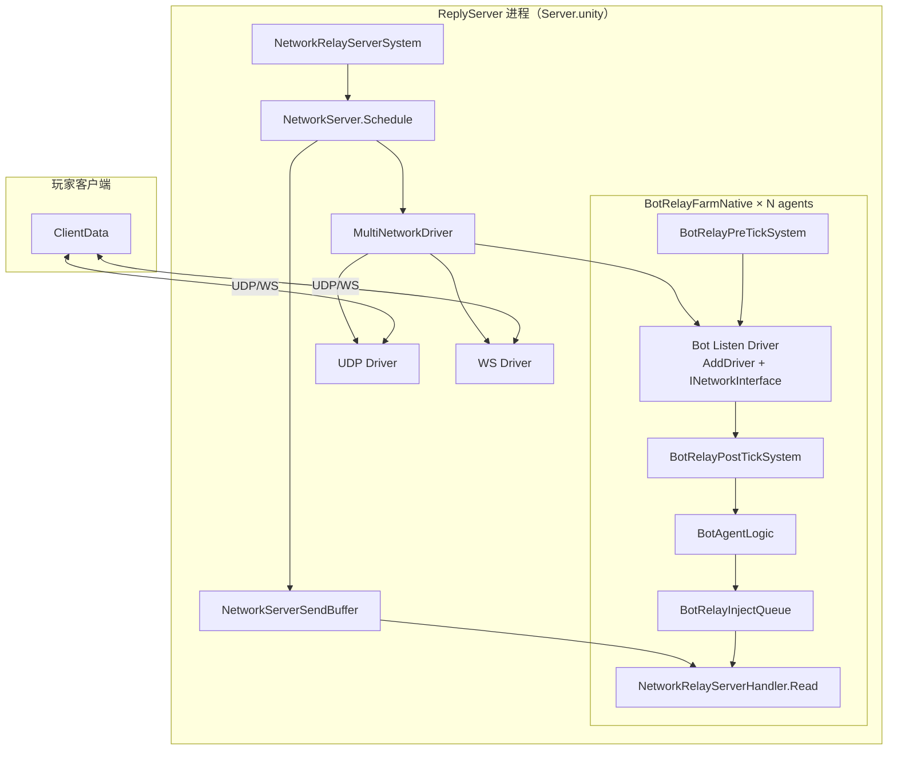

# 联机机器人 — 落地方案

> 基于 [联机机器人.md](./联机机器人.md)、[联机机器人-技术设计.md](./联机机器人-技术设计.md) 及 2026-06-18 架构对齐结论整理。  
> **目标**：Bot 与 ReplyServer **同进程共部署**，单进程多 Bot，**不改 Relay/Identity/Handler 撮合逻辑**。

> **文档索引**：[联机机器人-文档索引.md](./联机机器人-文档索引.md)  
> **架构约束（必读，不可偏离）**：[联机机器人-架构约束.md](./联机机器人-架构约束.md)

---

## 1. 已对齐的核心决策

| 议题 | 决策 |
|------|------|
| 部署形态 | Bot **与 ReplyServer 同进程**（`Server.unity`）；**非**多 Headless 进程连 Server |
| Transport | `NetworkRelayServer.AddDriver` 将 Bot Listen Driver 挂入 `MultiNetworkDriver` |
| ScheduleUpdate | **仅** `NetworkRelayServerSystem` → `NetworkServer.Schedule` 驱动 Bot Listen Driver |
| 连接模型 | **1 个 Bot Listen Driver（共享）** + **每 Bot 1 个 virtualPort** + **每 Bot 1 套 Farm 槽位状态/sendBuffer** |
| 虚拟客户端 | Connect / link 由 `BotRelayNetworkInterface` + `BotRelayManager` 注入确知 UTP wire；Connect 后业务 app 经 `BotRelayInjectQueue` → `NetworkRelayServerInjectSingleton` → 既有 `Handler.Read`。Server→Bot 仍经 `RouteSend` / virtualPort |
| 包归属 | Bot 代码与文档已并入 `ZGUPTerminator`；`BotConfig.asset` 保持工程级配置。其他 ZGUP 包的修改仍须负责人评估。Bot 侧遵守 Server 零分叉（M3） |
| 独立 Headless | **已于 2026-07-22 彻底下线**：不再有 `BotEntry` batch hook、`BotService`/`BotClient` 运行时、`BotBootstrap.unity` 或对应 Editor 菜单；`ClientData` 仅保留给真实服务器测试与录制工具。 |
| 录制回放 | TRBT + `BotReplayLogic`：生产路径按时间轴写入 `BotRelayInjectQueue`，经 Server Handler 消费。 |
| Bot vs Bot | Farm 匹配槽互斥 + 配对拒绝（`BotMatchGuard`，M7） |

---

## 2. 总体架构



### 2.1 职责边界

| 层级 | 负责方 | 职责 |
|------|--------|------|
| Transport 更新 | `NetworkRelayServerSystem` | 全部子 driver 的 `ScheduleUpdate`、Accept、PopEvents、Send |
| Bot→Server | PreTick + Agent / Replay Jobs | Connect / link ACK 以 UTP 注入；Connect 后业务消息写 `BotRelayInjectQueue`，由下一帧 Server 前的 flatten system 投递 Handler |
| Server→Bot | `BotRelayPostTickSystem` / Burst Jobs | Server Schedule **之后**：Drain、结构化 Inbox 解码、Agent；不再依赖 outbound UTP flush 成功 |
| 协议状态 | `BotSessionState`（Farm 槽位） | **不**写 `ReplyMessageShared` |
| 业务状态机 | `BotAgentLogic` | 组队 / 匹配 / 进关 / 回放 / 离队（对齐技术设计 §3） |

---

## 3. Tick 时序（单帧）

```
1. BotRelayPreTickSystem（UpdateBefore NetworkRelayServerSystem）
   └─ Connect 注入 → 必要 link ACK 回注（WireCatalog / Burst）

2. NetworkRelayServerSystem
   └─ BotRelayInjectFlattenSystem 先将上一帧业务 app 写入 Server inject API
   └─ NetworkRelayServer.Schedule()
        · MultiNetworkDriver.ScheduleUpdate()  ← 含 Bot Listen Driver
        · Accept / PopEvents / Scheduler / Send

3. BotRelayPostTickSystem（UpdateAfter NetworkRelayServerSystem）
   └─ Drain TryDequeueToBot → Inbox 解码
   └─ BotAgentLogic.Execute（状态机）
   └─ 业务 app 写入 BotRelayInjectQueue；必要 link ACK 回注
```

**关键约束**：Bot Listen Driver **只**在第 2 步由 Server System 更新；Connect / 下行在第 1、3 步经 Manager/WireCatalog 交互，Connect 后上行业务只经 inject queue / 既有 Handler。

---

## 4. ZGUP 包归属与已落地项

**原则**（负责人口径）：

1. **机器人归属 Terminator 包** — Bot 运行时、录制工具、Editor 测试与文档统一放在 `ZGUPTerminator`；`BotConfig.asset` 留在使用方工程。
2. **一程序集一目录** — 包根目录使用 `Terminator.MultiplayerBot*` 同级目录，禁止恢复工程侧 `Assets/Scripts/MultiplayerBot` 副本。
3. **其他包改动须负责人决策** — 对 `ZGUPEntitiesNetworkingCommon` 等其他包仍须完整评估后再修改。
4. **Bot 侧零分叉** — Bot 不得要求 Relay/Identity/Handler/撮合逻辑为 Bot 特化分支。

**已落地（负责人评估后自行修改）** — `ZGUPEntitiesNetworkingCommon`：

| API | 说明 |
|-----|------|
| `NetworkRelayServer.AddDriver(ref NetworkDriver)` | 共部署挂 Bot Listen Driver |
| `NetworkRelayServer.ListenDriver(ref NetworkDriver, ushort port)` | Bot Listen Bind（如 1390） |

**仍不改**：`NetworkRelayServerIdentity`、`NetworkRelayServerHandler`、`ModifyChannels`、Match 撮合、Send 路径。

---

## 5. ZGUPTerminator 代码结构（当前）

```
Terminator.MultiplayerBot/              # 生产运行时程序集
├── BotConfig.cs / BotMatchGuard.cs
├── Relay/
│   ├── BotCoDeployBootstrap.cs       # Server.unity 入口
│   ├── BotRelayWorld.cs              # Init / Shutdown
│   ├── BotRelayFarmSpawner.cs        # spawn N agents
│   ├── BotRelayAgentSystem.cs        # PreTick / PostTick ECS
│   ├── BotAgentLogic.cs              # 状态机（生产）
│   ├── BotRelayFarmNative.cs         # Farm 槽位、匹配槽
│   ├── BotRelayManager.cs            # virtualPort 队列
│   ├── BotRelayNetworkInterface.cs   # INetworkInterface
│   ├── BotRelayWireCatalog*.cs       # UTP wire 模板 + Blob 热路径
│   ├── BotRelaySlotInbox.cs / BotRelaySlotOps.cs / BotRelayCodec.cs
│   ├── BotRelayBurstWireOps.cs / BotRelayFarmTickJobs.cs
│   └── BotReplay*.cs                 # 进关回放
├── Bot/                              # 共部署 Farm 共享状态模型
│   └── BotAgentState.cs / BotState.cs / BotSessionState.cs
└── Recording/                        # 生产读取/序列化公共类型

Terminator.MultiplayerBot.Recording/          # Editor PlayMode 录制/回放程序集
Terminator.MultiplayerBot.Editor/             # 共部署 Editor 工具
Terminator.MultiplayerBot.Recording.Editor/   # 录制窗口与审计工具
Terminator.MultiplayerBot.Tests/              # Relay/状态机/PlayMode 测试
Terminator.MultiplayerBot.Recording.Tests/    # 录制测试
Documentation~/MultiplayerBot/        # 本文档集

Assets/Resources/Bot/BotConfig.asset  # 使用方工程配置，不进包
```

### 5.1 独立 Headless 路径（已下线）

| 组件 | 处置 |
|------|------|
| `BotEntry` / `BotService` / `BotClient` | 已删除；不再生成或启动独立 Headless Bot |
| `BotBootstrap.unity` / 创建场景菜单 | 已删除；不再提供独立 Headless 冒烟入口 |
| 生产替代 | `BotCoDeployBootstrap` + `BotAgentLogic` + Farm |

---

## 6. BotAgent 状态机

与 [联机机器人-技术设计.md §3](./联机机器人-技术设计.md) 一致：

- **Idle** → 将 `ClientMessageMatchToSend` 写入业务注入队列
- **PendingInvite** → 延迟后将 `SquadJoin` 写入业务注入队列
- **Matching** → 等待 Match / Mismatch（Farm 内匹配槽互斥）
- **InSquad** → 仅预组队且尚未收到 `MatchToRead` 时响应 `ApplyMatch`；单人撮合临时队伍无此阶段
- **InLevel** → TRBT 回放
- **Leaving** → `SquadLeave`

差异：共部署路径读写 `BotSessionState`，**不**用 `ReplyMessageShared` / `LevelPlayerShared`。

---

## 7. 分阶段实施与验收

### Phase 1 — 共部署骨架 ✅

- [x] `NetworkRelayServer.AddDriver` / `ListenDriver`
- [x] `BotCoDeployBootstrap` + `BotRelayWorld` + Farm spawn
- [x] `BotRelayNetworkInterface` + `BotRelayManager`

**验收**：Server 场景启动后 Bot userID 出现在 connection 列表。

### Phase 2 — WireCatalog 热路径 ✅

- [x] Init ephemeral 采 UTP 模板（Connect / hello / link ACK）
- [x] `EnqueueToListen(virtualPort, utpWire)` Connect 注入
- [x] Status / MatchToSend app inject + Server→Bot inbound 解包
- [x] Link ACK 循环 + `disconnectTimeoutMS=0`
- [x] `BotRelayWireCatalogHost` + Blob Burst Job 链（PostTick `IJobParallelFor`）
- [x] Replay Catalog（Persistent `NativeArray` + 嵌套 Recording Blob）+ `ReplayTickJob`（Shutdown `CompletePending`）
- [x] MCP：Connect + MatchToSend + 35s 无 Disconnect

**数据路径**：Connect：PreTick → WireCatalog → `EnqueueToListen` → Server Schedule；业务上行：Agent / Replay → `BotRelayInjectQueue` → Flatten → Handler；下行：`RouteSend` → PostTick `TryDequeueToBot` → Inbox → Agent。

### Phase 3 — 组队 / 匹配 / 离队（进行中）

- [x] Inbox 解码 Public / Channel 基础消息
- [x] Idle → MatchToSend；ApplyMatch 响应
- [x] Bot vs Bot 规避（`BotMatchGuard`）
- [x] Connect 后业务上行改为 `BotRelayInjectQueue → Handler.Read`；生产 Job 链不再 flush 业务 UTP outbound
- [ ] Join/ApplyMatch/Leave **inject → Handler → Inbox ack** 全链路 — PlayMode §6.1 自验证全绿后，再请真人 SquadInvite 复核
- [ ] Remote 出关 → SquadLeave 端到端

**当前实现（2026-07-30）**：匹配的登录/进关描述已从 Host `Play` 和两张 Bot 配置表中解耦。双方在 `Register` 后调用 `LoginManager.ApplyStart`，由 ApplyStart 单次广播 `ClientMessageMatchStart(type=24)`，携带当前 `matchID`、服务器 `userStageID`、`isRestart/levelID/stage/levelName/sceneName`。Bot 只接受当前 matchID 的描述，先按该 tuple 选录像并发送登录 PlayerProperty（Status=0），下一 Tick 再发送 PlayerProperty + 非零 Status 并启动回放；匹配 Host/Joiner 使用同一路径。`LoginManager.__Start` 仅在 `match==0` 的普通组队发送 `Play`，匹配接收端仍保留 `match!=0` 防御忽略。原 `rankedMatchScenes` / `rankedMatchStageIDs` 及取模/段位映射代码已删除。L2 在 PopEvents offset 0 对完整 MatchStart 做结构校验并直接提交，禁止其 level/scene 字节进入通用 inner-offset 扫描；Connect/Play/MatchStart 等显式类型均不得进入 Invite canonicalize/评分。

**本轮追加（2026-07-26）**：真人移除 Bot 后立即再次邀请时，新 Invite 已到达全部 Bot，但旧 Bot 的显式 `Drop` 被 InLevel 的普通 `Leave` 防抖一并忽略；旧频道虽已清空，旧 `squadSlotOwner` 仍占用，其他 Bot 全部以 `farm-squad-claimed` 避让。现已区分两类事件：Host 启动阶段的瞬时 `Leave` 继续由 live Stage 去抖；Server 明确 `Drop` 则在同一 Agent Tick 立即停止回放、清空 Stage/频道并释放队伍租约，使同批后续 Invite 可重新接受。EditMode Regression **156/156**、PlayMode 单会话门禁 **1/1** 通过，待真人执行“移除 → 立即再邀请”复核。

**验收**：玩家世界邀请超时后 Bot 入队；玩家出关 Bot 离队；**无** Bot↔Bot 撮合。

### Phase 4 — 关卡回放（进行中）

- [x] PlayerProperty 与 gameplay 回放帧生产路径改为 inject，避免占用已废弃的 UTP outbound 槽
- [x] 回放按完整 Server Delta 推进，并在当前 Tick 注入时间轴上全部已到期帧；不以固定条数拆分同时间戳批次。异常时间戳由 RecordingAudit 拦截；生产默认关闭逐包 `RouteSend peeled` 日志
- [ ] 普通组队 `Play → PlayerProperty → SetStatus → TRBT`；匹配 `Match → MatchStart → 登录 PlayerProperty(Status=0) → 下一 Tick PlayerProperty + SetStatus → TRBT` 的 Server Handler / Host 可见全链路
- [ ] 真人 Host 侧 `RemotePlayer.Joined` 不卡死

### Phase 5 — 运维（未开始）

- [ ] **运行时**动态扩缩（当前：启动时 `Clamp(minBots, maxBots)` 固定 count）
- [ ] 监控指标
- [ ] 部署 Runbook

---

## 8. 配置项（BotConfig）

| 字段 | 说明 |
|------|------|
| `enableCoDeploy` | 是否在 ReplyServer 场景启用 Bot Farm（默认 true） |
| `botRelayPort` | Bot Listen 端口，默认 1390 |
| `botProfiles` | Bot 账号与展示信息 |
| `minBots` / `maxBots` | **启动时** spawn 数量（非运行时动态） |
| `inviteTimeoutMin/Max` | 世界邀请延迟 |
| `botProfiles[].matchLevel` | 每个 Bot 的 `ClientMessageMatchToSend.level`；与真人 `sourceRank` 一致，是零基段位索引，`0` 合法，负值/未配置回退 `0` |
| `replyServerAddress/Port` | 真实服务器测试客户端与录制工具连接地址/端口 |

---

## 9. 风险

| 风险 | 缓解 |
|------|------|
| WireCatalog 无 live UTP 客户端 | Link ACK 回注 + Listen timeout 关闭（§架构约束 7.1） |
| 不复用 SharedStatic | `BotRelaySlotInbox` 完整解码至 `BotSessionState` |
| Bot 作 Host | Phase 4 对照 `LoginManager.__Start` Host 分支 |
| 独立 Headless 残留 | 已删除入口、场景生成菜单与专属回放实现；共部署 Farm 为唯一 Bot 运行路径 |
| 注入队列积压 | `NativeQueue<BotRelayInject>` 无容量上限；健康录像按原时间轴完整回放，不允许用运行时限流改写时序。素材部署前必须由 RecordingAudit 拦截同时间戳 Move 塌缩；运行时仍应补每帧 drain / 高水位监控用于报警，但不得静默丢帧或回退到 UTP。 |
| 录制帧超过旧注入容量 | 已从 `FixedList512Bytes` 改为 `BotRelayPacket` 的 1472B 固定容量。98 份现有录制中有 141 帧为 511–680B，旧 500B 容量会静默丢弃；新增回归覆盖 680B 保真。未来超过 1472B 的录制须在录制校验阶段拦截并上报。 |

---

## 10. 修订记录

| 日期 | 内容 |
|------|------|
| 2026-06-18 | 初稿：AddDriver 共部署、单 ScheduleUpdate、INetworkInterface |
| 2026-06-18 | 架构约束；驳回 mirror/encode-island 热路径 |
| 2026-06-18 | **全面对齐**：去 Headless/IPC 旧描述；模块名与代码一致；阶段进度更新；Legacy 标注 |
| 2026-07-22 | 业务上行由 UTP wire flush 改为 Server 注入；记录 Phase 3/4 尚未验通的邀请入队与进关回放问题，验收改为 Handler/ack/状态机闭环 |
| 2026-07-23 | InLevel 不再因录像耗尽回 Idle；邀请入口增加 live stage/session 守卫；匹配段位对齐零基 `sourceRank`、默认 0；EditMode `Regression` 155/155，PlayMode 单会话门禁通过，真人端到端待验收。 |
| 2026-07-23 | 队内匹配握手对齐真人：Bot 收 ApplyMatch 只回同意；仅 MatchToRead 设置 `matchPaired`，删除从 SquadJoin/Create 提前判定匹配成功的旧逻辑。 |
| 2026-07-23 | 区分预组队匹配与单人撮合临时队伍：前者在 Match 前走 ApplyMatch 同意，后者无 ApplyMatch；两者收到 MatchToRead 后统一走匹配进关，且忽略迟到 ApplyMatch。 |
| 2026-07-23 | 修复 ApplyMatch 前 Bot Status 变成非零：Join/ChapterStage 不再启动普通组队握手，只有 Host Play（普通组队）或 MatchToRead（匹配）可以授权进关；Regression 156/156。 |
| 2026-07-23 | 修复普通邀请进关 `Joined → Canceled`：下线错误的 `Status(stage) → PlayerProperty → Status(0)` 登录清零阶段，Host Play 后仅发送 `PlayerProperty → Status(stage)`；删除 8 条过时握手测试，Regression 148/148、PlayMode 1/1。 |
| 2026-07-23 | 修复匹配进关卡死：首个 `Match(matchID=1, level=0)` 经 Huffman 位打包后仅 2 字节，旧解析按“两个剩余字段至少两字节”误丢事件，导致只 Join 临时队伍而 `matchPaired=false`；现改为结构化读取后检查 `HasFailedReads`，Regression 148/148。 |
| 2026-07-23 | 修复先邀请后匹配复用 Stage 56：Match 建立新 Stage 代际并清除旧 session/target/lastSeen/property 状态；重复 Join 的旧 channelFlag 无效，只在 Match 后新 Status/Query/ChapterStage 到达后启动 replay；Regression 149/149、PlayMode 1/1。 |
| 2026-07-26 | 修复 Linux Server 邀请后反复离队/加入：`SquadJoin` 清理回放状态时错误进入 `BotReplayLogic.Stop$BurstDirectCall` 并在 Mono fallback 抛异常，导致本地状态半提交；移除 Job helper 的方法级 Burst 入口并加回归门禁。Regression 151/151、PlayMode 1/1，待新 Linux 包真人复核。 |
| 2026-07-23 | 修复组队后匹配卡在等待 Remote Stage：Server 因 210→210 不重发 Status 时由 Bot Query 取现值；Query + ClientHeader 大回包不再误选 UTP 头部短帧或被 Invite shell 拒绝；Regression 150/150。 |
| 2026-07-26 | 中间尝试：收到 Match 后立即发送 PlayerProperty + Status 解除 Status 互等；实链证明机器人会进 InLevel，但真人 Host 反而卡在 remote login，因此该单阶段方案已被下一条修订取代。Regression 152/152。 |
| 2026-07-26 | 最终修正真人 Host + Bot 非 Host 的匹配登录顺序：Match 后先发登录 PlayerProperty 且 Status=0，等 Host 实际 Play 后再发 PlayerProperty + 非零 Status 并回放；保留显式服务器 Stage 映射，阻止 remote ChapterStage 覆盖。Regression 154/154，待真人复核。 |
| 2026-07-26 | 第二次实链确认 Server 已收到/广播 Host `type=21 Play`，但 L2 peel 将含段位文本的 53–55B Play 误扩写为 97B Invite。收紧为“先读首个 packed type，再决定 Invite canonicalize/评分”，新增现场字段回归；传输 21/21、Regression 155/155、PlayMode 1/1。 |
| 2026-07-26 | 修复房主移除 Bot 后立即再邀请无人响应：显式 Server `Drop` 不再被关内普通 `Leave` 防抖忽略，立即清理 InLevel 并释放 Farm 队伍租约；同 Tick 后续 Invite 可重新 claim。Regression 156/156、PlayMode 1/1。 |
| 2026-07-27 | Linux 实链修复多个真人并发邀请无人响应：旧 `squadSlotOwner` 将正在服务的 squad 7 错误扩大为全 Farm 租约，导致 squad 5/10/11 的空闲 Bot 全报 `farm-squad-claimed`。现按 squadID 去重，同队单 Bot、不同队多 Bot 并发，且各自独立释放。Regression 156/156、PlayMode 单会话门禁 1/1。 |
| 2026-07-29 | 修复 Linux Server 长跑后 Bot 回放不动/幅度小：`RouteSend peeled` 每包日志原本累计约 6.2 万次且每条附调用栈，持续拖低 Tick；同时 0.1s/Tick 时间截断会在低于 10Hz 后把录像永久慢放。现默认关闭该高频日志，回放按完整 Delta 推进；移除每 Tick 6 条旧限流，全部已到期帧按录像时序注入，局部/整段同时间戳 Move 塌缩由 RecordingAudit 报 Error。Regression 164/164、PlayMode 单会话门禁 1/1。 |
| 2026-07-29 | 匹配进关协议改由 `LoginManager.ApplyStart` 广播 `MatchStart(type=24)`，一次携带 matchID、服务器 Stage 与完整 level/scene tuple；Bot Host/Joiner 统一两 Tick 握手，匹配不再发送/依赖 Play。删除 `rankedMatchScenes`、`rankedMatchStageIDs` 与对应取模/映射代码。 |
| 2026-07-30 | 修复线上匹配后真人稳定卡在等待远端 Stage：Server 日志显示 Bot 已 `matchPaired` 且收到真人 PlayerProperty，但 `targetStage=0/flags=0`。把回归从零前缀假帧换成捕获的 pipeline 壳后 100% 复现：通用 inner-offset 规范化把完整 `type=24` 误选为内部 `type=11`。现先结构校验并保留 offset 0 MatchStart，发送端仍单次发送，不增加循环；最新日志 tuple 回归、Regression 144/144、单会话 PlayMode 门禁 1/1 通过。 |
